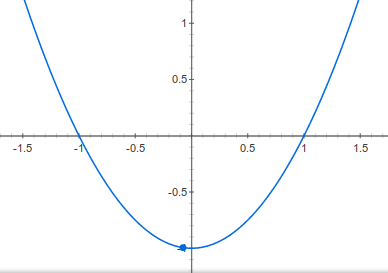

# Δευτεροβάθμιες εξισώσεις

  Ένας εύκολος τρόπος να λυθεί μία εξίσωση $$αx^2+βx+γ=0\text{, }α\ne 0$$ είναι να υπολογίσουμε την διακρίνουσα $Δ=β^2-4αγ$. Αν

* $Δ>0$ η εξίσωση έχει δύο πραγματικές ρίζες στο $\mathbb{R}$ τις $x_{1,2}=\frac{-β\pm \sqrt{Δ}}{2α}$
* $Δ=0$ η εξίσωση έχει μία διπλή πραγματική ρίζα την $x=-\frac{β}{2α}$
* $Δ\lt 0$ η εξίσωση έχει δύο μιγαδικές ρίζες τις $z_{1,2}=\frac{-β\pm i\sqrt{-Δ}}{2α}$

## Γραφική παράσταση
Η γραφική παράσταση της συνάρτησης $f(x)=x^2-1$ είναι η

